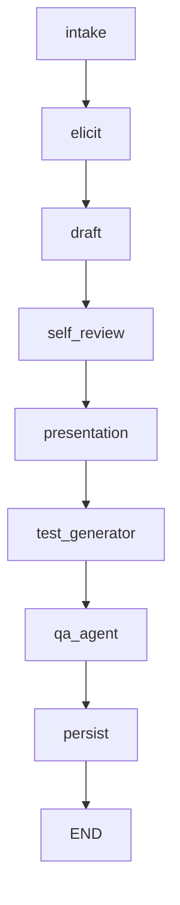

# Design do Pipeline "Gasoduto"

* **Interrupt before `presentation`** – o grafo pausa antes de enviar a pergunta ao usuário.  O nó `presentation` produz a mensagem de revisão da skill e marca `awaiting_user=True`.  Quando o cliente envia a resposta (via `/interview/continue`), o grafo retoma a partir desse ponto.
* Cada nó recebe e devolve um **LexGraphState** (TypedDict) contendo todo o contexto da entrevista.
* O grafo é compilado com `lex_graph.compile()`; a chamada `await lex_graph.ainvoke(state)` executa de forma assíncrona.

## Fluxo de Controle
1. **Start** – `intake` classifica a tarefa e inicia o estado.
2. **Elicit** – para cada estágio de coleta (`papel_agente`, `normas_referencia`, …) gera uma `structured_question` e define `awaiting_user=True`.
3. **Draft** – cria o rascunho da skill.
4. **Self‑Review** – iterativamente melhora o rascunho (máximo de iterações pode ser controlado externamente).
5. **Presentation** – entrega o rascunho ao usuário e pausa.
6. **Test Generator** – cria casos de teste automáticos.
7. **QA Agent** – chama o wrapper que roda `agentskill_quality.sh`.
8. **Persist** – grava a skill final em disco.

Esta arquitetura permite **isolamento** (cada nó tem responsabilidade única) e **extensibilidade** – novos nós podem ser inseridos entre `self_review` e `presentation` sem mudar a API.
